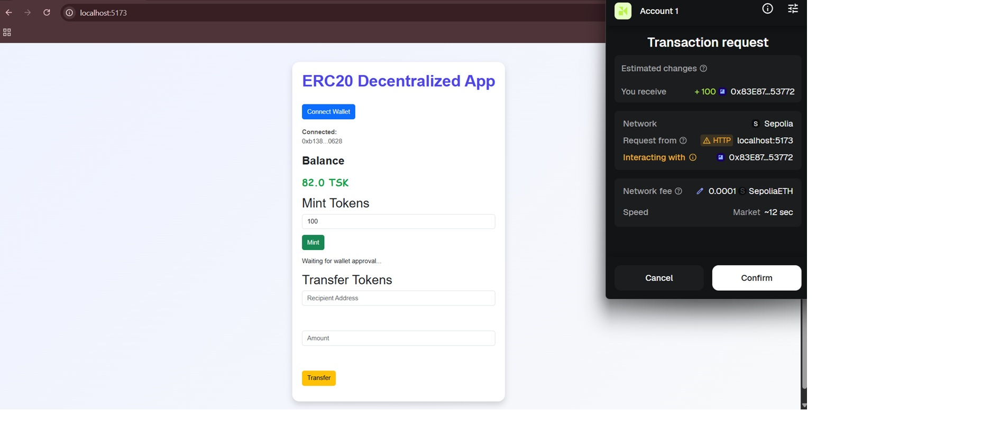
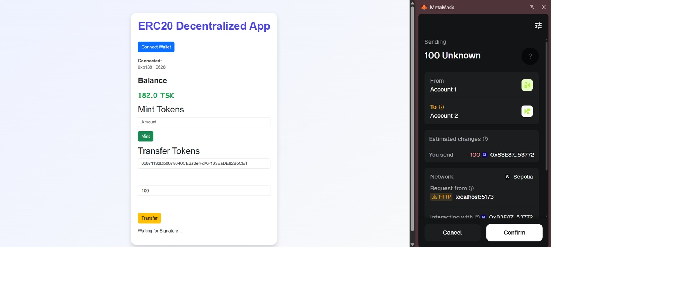

# ERC20 Token Dapp

A full-stack decentralized application (Dapp) built using **Solidity**, **Foundry**, **React**, and **Ether.js**. The
application allows users to connect their MetaMask wallet, view their ERC20 Token balance, mint new tokens (owner only), and transfer tokens to another address.

```
## Features

- Connect MetaMask wallet
- Display connected wallet address
- Display ERC20 token balance
- Owner-only token minting
- Transfer tokens to another address by owner and later if somebody wants to transfer their tokens to someone then they do it
- Transaction status feedback
- View transaction on Sepolia Etherscan to know that the transaction is succeed or not
- Responsive UI built with React + Bootstrap

```

## Tech Stack

### Smart Contract
- Solidity version `^0.8.27`
- OpenZeppelin ERC20 and Ownable
- Foundry

### Frontend
- React (Vite)
- Ethers.js v6
- Bootstrap 5

### Network
- Ethereum Sepolia Testnet

---

# Project Structure

```
erc20-contract/
│
├── src/
│   └── Task.sol
│
├── script/
│   └── Task.s.sol
│
├── frontend/
│   ├── src/
│   │   ├── components/
│   │   │   ├── Wallet.jsx
│   │   │   ├── Balance.jsx
│   │   │   ├── Mint.jsx
│   │   │   └── Transfer.jsx
│   │   ├── config/
│   │   │   └── contract.js
│   │   ├── App.jsx
│   │   └── App.css
│   └── package.json
│
└── README.md
```

---

# Setup Instructions

## 1. Clone Repository

```bash
git clone <YOUR_GITHUB_REPOSITORY_URL>
```

```bash
cd erc20-contract
```

---

## 2. Install Smart Contract Dependencies

```bash
forge install
```

---

## 3. Environment Variables

Create a `.env` file in the project root.

```env
SEPOLIA_RPC_URL=<YOUR_RPC_URL>

SEPOLIA_PRIVATE_KEY=<YOUR_PRIVATE_KEY>

ETHERSCAN_API_KEY=<YOUR_API_KEY>
```

---

## 4. Deploy Contract

```bash
forge script script/Task.s.sol:TaskScript \
--rpc-url $SEPOLIA_RPC_URL \
--private-key $SEPOLIA_PRIVATE_KEY \
--broadcast
```

(Optional)

Verify contract

```bash
forge verify-contract <YOUR_DEPLOYED_CONTRACT_ADDRESS> src/Task.sol:Task --chain sepolia --etherscan-api-key $ETHERSCAN_API_KEY
```

---

## 5. Frontend Setup

Go to frontend folder

```bash
cd frontend
```

Install packages

```bash
npm install
```

Run application

```bash
npm run dev
```

Open

```
http://localhost:5173
```

---

# Configure Contract

Open

```
frontend/src/config/contract.js
```

Update
```
- Contract Address
broadcast/Tast.s.sol/run-latest.json
"contractAddress": "<YOUR_DEPLOYED_CONTRACT_ADDRESS>",
```
- Contract ABI

out/Task.sol --> In your project root you see `out/` folder, look for your contract name folder with `.sol` tag
inside this folder you see `.json` file then copy the full ABI code more details give in below example that where you paste this ABI code.

Example

make two folders in frontend folder first one is `abi` folder inside this make `.json` file and paste your ABI code here then make second folder in frontend directory is `config` inside this make `.js` file and update your address and abi by this below
code.
```javascript
export const CONTRACT_ADDRESS = "<YOUR_CONTRACT_ADDRESS>";

export const CONTRACT_ABI = [...];
```

---

# How To Use

### Connect Wallet

- Open MetaMask
- Switch to Sepolia
- Click **Connect Wallet**
- Approve connection

---

### View Balance

After connecting, your ERC20 token balance will be displayed automatically.

---

### Mint Tokens

Only the contract owner can mint.

Steps

1. Enter token amount
2. Click **Mint Tokens**
3. Confirm transaction in MetaMask
4. Wait for confirmation

---

### Transfer Tokens

Steps

1. Enter recipient address
2. Enter amount
3. Click **Transfer Tokens**
4. Confirm transaction

---

### Transaction

After successful mint or transfer:

- Status message is displayed
- Transaction hash is available
- Click **View Transaction** to open Sepolia Etherscan

---

# Smart Contract

Contract Name

```
Task
```

Token Name

```
Task
```

Token Symbol

```
TSK
```

---

# Contract Information

Network

```
Sepolia
```

Contract Address

```
<YOUR_CONTRACT_ADDRESS>
```

Etherscan

```
https://sepolia.etherscan.io/address/<YOUR_CONTRACT_ADDRESS>
```

---

# Screenshots


### Wallet Connected


### Mint Tokens



### Transfer Tokens



---

# Future Improvements

- Better UI/UX
- Toast notifications
- Network auto-switch
- Dark mode
- Token logo
- Responsive mobile design

---

# Author

**Sarthak**

Junior Solidity Smart Contract Developer

GitHub:
https://github.com/SarthakKumar-23

LinkedIn:
www.linkedin.com/in/sarthak-kumar-79a2083b2